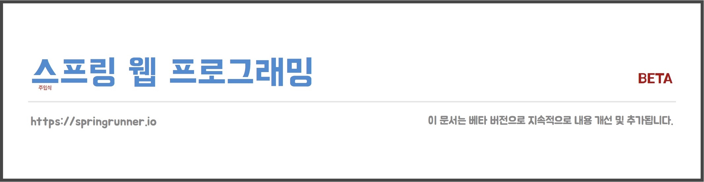

> 본 학습 자료는 현재 베타(beta) 베타 버전으로 지속적으로 내용 개선 및 추가됩니다.

# 스프링 웹 프로그래밍(Spring Web Programming) 배우기
[스프링러너(SpringRunner)](https://springrunner.io) 트레이닝 과정 중 스프링을 이용해서 웹 애플리케이션을 개발할 때 필요한 지식과 스프링 웹 기술을 학습시 사용되는 자료와 예제입니다. 스프링이 다루는 기술이 매우 폭 넓고 사용법도 다양하기에 모든 내용이 아닌 실무에서 사용되는 스프링 웹 기술을 중심으로 작성되었습니다.

  

[여기](https://drive.google.com/open?id=15wK2sZm0XaWiRsnsZV7nrJd7rTHQiRQk)에서 학습 자료를 볼 수 있습니다. 자료 중 일부는 비공개 처리되어 있습니다. 비공개 영역은 스프링러너 트레이닝에서 만날 수 있습니다.

`spring-web-showcase` 프로젝트는 간단한 예제를 통해 다양한 스프링 웹 기능을 볼 수 있도록 작성되었습니다. (문서에서 다루지 않는 기능들도 포함되어 있습니다.)

## 구성
본 학습 과정은 다음과 같이 구성되어 있습니다.

* 제 1장, 자바 웹 애플리케이션
* 제 2장, 스프링 웹 기술
* 제 3장, 안녕, 스프링 웹 프로그래밍
* 제 4장, 코드로 익히는 스프링 웹 프로그래밍 (워크숍Workshop)
* 제 5장, HTTP 요청과 핸들러 연결하기
* 제 6장, 핸들러로 요청 데이터 다루기
* 제 7장, HTTP 응답 콘텐트 만들기
* 제 8장, 예외 처리하기
* 제 9장, 요청과 응답 가로채기
* 제 10장, 메시지 및 국제화 처리하기
* 제 11장, 스프링 웹 테스트 (준비 중)
* 부록, 웹 애플리케이션 아키텍처

## 학습 조건
본 학습을 따라가려면 자바(Java)와 웹(Web) 기술에 대한 이해가 필요합니다.

* 자바(Java)에 언어 특징과 문법을 이해하고 사용할 줄 알아야 합니다.
* 웹 기술(HTML, CSS, JavaScript)을 알고 있어야 합니다.

## 관련된 스프링러너(SpringRunner) 트레이닝 과정

### Mastering Spring Web 101 Workshop

Spring MVC와 Spring Boot로 웹 애플리케이션 서버 사이드(Server-side)를 직접 개발하며 학습하는 소규모 워크숍입니다. 참가자는 16시간 동안 실습 중심으로 스프링 웹 프로그래밍을 배우고 경험 할 수 있습니다.

워크숍 상세 정보는 [여기](https://springrunner.io/training/mastering-spring-web-101-workshop/)를 통해 볼 수 있습니다.